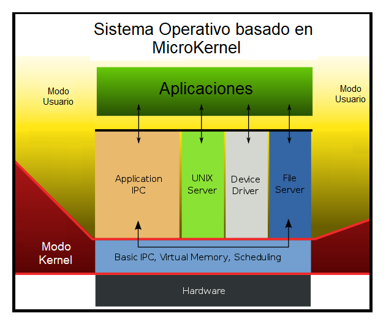
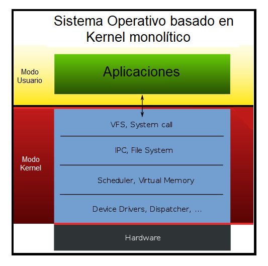
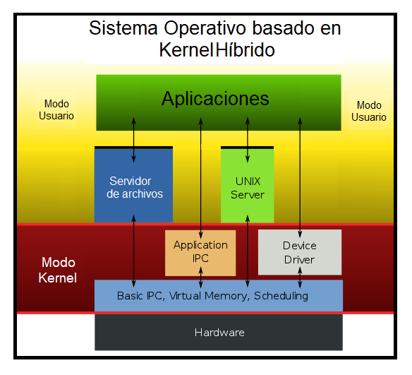

# USAC - Ingeniería
## Sistemas Operativos 1 N - Actividad 1 
## 25 de julio de 2023
#
### Datos:

| Carné    | Nombre    |
|---------- |---------- |   
| 200310165 | *José Abraham Navarro de León*  |

<!-- Jose -->
---
## Tipos de Kernel y sus diferencias
**¿Qué es el Kernel?:**

El kernel es definido como el núcleo o corazón del sistema operativo, y se encarga principalmente de mediar entre los procesos de usuario y el hardware disponible en la máquina, es decir, concede el acceso al hardware, al software que lo solicite, de una manera segura; y el procesamiento paralelo de varias tareas.

Este núcleo gestiona recursos mediante servicios de llamada al sistema operativo y decide cuáles son los programas que harán uso de un dispositivo de hardware y cuál será su duración, distribuyendo los recursos de la mejor forma, para que los componentes externos e internos del ordenador puedan trabajar en conjunto. Otra de sus funciones, es la de administrar la memoria de los procesos y programas en ejecución.

El kernel también se encarga de conceder permisos, facilitar la comunicación entre programas, de gestionar las diversas labores de un dispositivo, manejar el procesador, periférico y almacenamiento el sistema. Básicamente, el nucleo del sistema será el principal responsable del funcionamiento de la máquina y la administración de sistema, desde su arranque.

El núcleo kernel informática consta de diferentes capas que conforman su estructura, siendo la más baja, la interfaz con el hardware, la cual se encarga tareas como el control de red. La siguiente capa es la de gestión de memoria, que tiene por función distribuir la memoria RAM y la memoria virtual. Sobre esta capa se encuentra el gestor de procesos, el cual controla lo relacionado con el tiempo, permitiendo la realización de varias actividades a la vez o multitasking.

Luego aparece la capa Device Managment, que gestiona el dispositivo. Y finalmente, se encuentra la capa del sistema de archivos, donde se le asigna un espacio a los procesos, ya sea en la memoria principal o en la secundaria.

**Tipos de Kernel:**

De acuerdo a las consideraciones arquitectónicas del núcleo Kernel, se pueden categorizar en:

**Microkernel o micronúcleo:** se basa en ofrecer las funciones básicas de cada dispositivo, administrando aquello que tenga CPU, memoria e IPC. Esto supone un mayor control de dispositivos. Son más compactos que otro tipo de núcleos, por lo que brindan un conjunto reducido de abstracciones básicas del hardware, lo cual brinda beneficios en cuanto a portabilidad, seguridad y su capacidad para adaptarse. Sin embargo, el rendimiento de la máquina puede verse afectado, especialmente, en lo que respecta a la velocidad de las reacciones del hardware, y los tiempos de espera de los procesos para obtener información o tener acceso a otros.

**Núcleos monolíticos:** se trata de un gran nucleo informatico para todas las tareas del sistema. Es de tipo no modular y puede alcanzar un mayor rendimiento que un microkernel. Los kernel monolíticos deben incorporar códigos que operen con varios dispositivos, canales de interrupción y demás operadores de hardware, por lo que, para realizarle modificaciones se requiere de la compilación del núcleo y reiniciar el sistema.
Kernel del sistema Linux: el núcleo de Linux es monolítico, por lo que los programas tienen mayor acceso al hardware y mantienen mejor comunicación entre sí, pero tiene dificultades a nivel de seguridad. Utiliza los llamados módulos de Kernel para agregar o quitar características del núcleo en el momento en que se necesite.

Núcleos híbridos: incluyen un código adicional en el núcleo para que se ejecuten labores más rápidamente. Se puede elegir qué acciones ejecutar en modo usuario, y cuáles en modo supervisor.

---
## User Mode vs Kernel Mode 

**User Mode:**
Al iniciar una aplicación en modo de usuario, el sistema operativo crea un proceso para la aplicación. El proceso proporciona a la aplicación un espacio de direcciones virtuales privado y una tabla de identificadores privados. Dado que el espacio de direcciones virtuales de una aplicación es privado, una aplicación no puede modificar los datos que pertenecen a otra aplicación. Cada aplicación se ejecuta de forma aislada y, si una aplicación se bloquea, el bloqueo se limita a esa aplicación. Otras aplicaciones y el sistema operativo no se ven afectados por el bloqueo.

Además de ser privado, el espacio de direcciones virtuales de una aplicación en modo de usuario está limitado. Un proceso que se ejecuta en modo de usuario no puede acceder a direcciones virtuales reservadas para el sistema operativo. Limitar el espacio de direcciones virtuales de una aplicación en modo de usuario impide que la aplicación altere y, posiblemente, dañe los datos críticos del sistema operativo.

**Kernel Mode:**
Todo el código que se ejecuta en modo kernel comparte un único espacio de direcciones virtuales. Por lo tanto, un controlador en modo kernel no está aislado de otros controladores y del propio sistema operativo. Si un controlador en modo kernel escribe accidentalmente en la dirección virtual incorrecta, los datos que pertenecen al sistema operativo u otro controlador podrían verse comprometidos. Si se bloquea un controlador en modo kernel, se bloquea todo el sistema operativo.

**Relacion entre los componentes del modo usuario y del modo kernel:**

