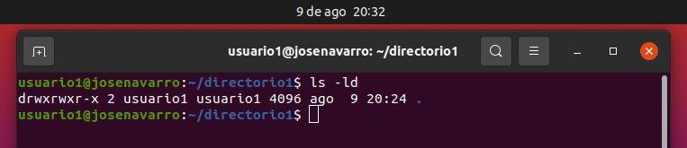

# USAC - Ingeniería
## Sistemas Operativos 1 N - Actividad 3
## 9 de agosto de 2023
#
### Datos:

| Carné    | Nombre    |
|---------- |---------- |   
| 200310165 | *José Abraham Navarro de León*  |

<!-- Jose -->
---
## Parte 1: Gestión de Usuarios
**1.1 Creación de Usuarios:** Crea tres usuarios llamados "usuario1", "usuario2" y "usuario3".

Comando:

    sudo adduser usuario1

Salida:

Comando:

    sudo adduser usuario2

Salida:

Comando:

    sudo adduser usuario3

Salida:

**1.2 Asignación de Contraseñas:** Establece una nueva contraseñas para cada usuario creado.

Comando:

    sudo passwd usuario1

Salida:

Comando:

    sudo passwd usuario2

Salida:

Comando:

    sudo passwd usuario3

Salida:

**1.3 Información de Usuarios:** Muestra la información de `usuario1` usando el comando `id`.

Comando:

    id usuario1

Salida:

**1.4 Eliminación de Usuarios:** Elimina `usuario3`, pero conserva su directorio principal. 

Comando:

    sudo deluser usuario3

Salida:

---
## Parte 2: Gestión de Grupos

**2.1 Creación de Grupos:**  Crea dos grupos llamados `grupo1` y `grupo2`.

Comando:

    sudo groupadd grupo1

Salida:

Comando:

    sudo groupadd grupo2

Salida:

**2.1 Agregar Usuarios a Grupos:**  Agrega `usuario1` a `grupo1` y `usuario2` a `grupo2`.

Comando:

    sudo adduser usuario1 grupo1

Salida:

Comando:

    sudo adduser usuario2 grupo2

Salida:

**2.3 Verificar Membresía:** Verifica que los usuarios han sido agregados a los grupos utilizando el comando `groups`.

Comando:

    groups usuario1

Salida:

Comando:

    groups usuario2

Salida:

**2.4 Eliminar Grupo:**  Elimina `grupo2`.

Comando:

    sudo groupdel grupo2

Salida:

## Parte 3: Gestión de Permisos

**3.1. Creación de Archivos y Directorios:**  

    
    3.1.1 Como `usuario1`, crea un archivo llamado `archivo1.txt` en su directorio principal y escribe algo en él.

Comandos:

Con el siguiente comando se ingresa al usuario en cuestión.

    su usuario1

Ahora se crea el archivo de texto, se escribe una linea de texto y se guarda con Ctrl+D.

    cat > archivo1.txt
    prueba archivo1 de texto en directorio principal de usuario1.
    Ctrl+D

    3.1.2 Crea un directorio llamado `directorio1` y dentro de ese directorio, un archivo llamado `archivo2.txt`.

Comandos:

    mkdir directorio1

    cd directorio1
    cat > archivo2.txt
    prueba archivo2 de texto en directorio1 de usuario1.
    Ctrl+D

**3.2 Verificar Permisos:**   Verifica los permisos del archivo y directorio usando el comando `ls -l` y `ls -ld` respectivamente.

Comandos:

    ls -l

    ls -ld

**3.3 Modificar Permisos usando `chmod` con Modo Numérico:**    Cambia los permisos del `archivo1.txt` para que sólo `usuario1` pueda leer y escribir (permisos `rw-`), el grupo pueda leer (permisos `r--`) y nadie más pueda hacer nada.

Se aprecian los permisos actuales

Se hace el cambio de permisos.
Comandos:

    chmod 744 archivo1.txt

Nuevos permisos.

